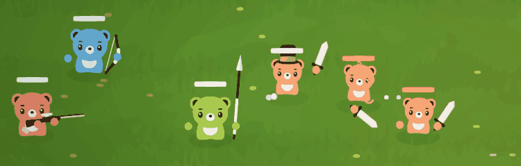

# leo schweiger 

I’m a student and game developer based in Salzburg, Austria, with a focus on gameplay programming.

- portfolio: [leoschweiger.com](https://leoschweiger.com)  
- resume: [resume-leo-schweiger.pdf](https://leoschweiger.com/resume-leo-schweiger.pdf)  
- contact: leo@leoschweiger.com  

## skills
- game programming, shaders/rendering, tools  
- Unity, Defold, Unreal  
- C#, C++, Lua, Python, Astro, basic web stack

## games

### fight guys

A physics-based auto battler with asynchronous multiplayer matches. Players build teams of up to five units that fight automatically using physics-driven interactions. Units can be modified with items, potions, and stat upgrades. Built in Unity for Web.

### pinboll

A modern take on the classic pinball game, built entirely from scratch using C++ and SFML. Players can build their own pinball boards by placing unique bumpers with different behaviors, experiment with setups, and compete for the highest score.

### lil’guy

A fast-paced arcade slasher built entirely from scratch in C# using SFML. Players control the lil’guy, performing combos to defeat enemies, rack up points, and compete on the online leaderboard.